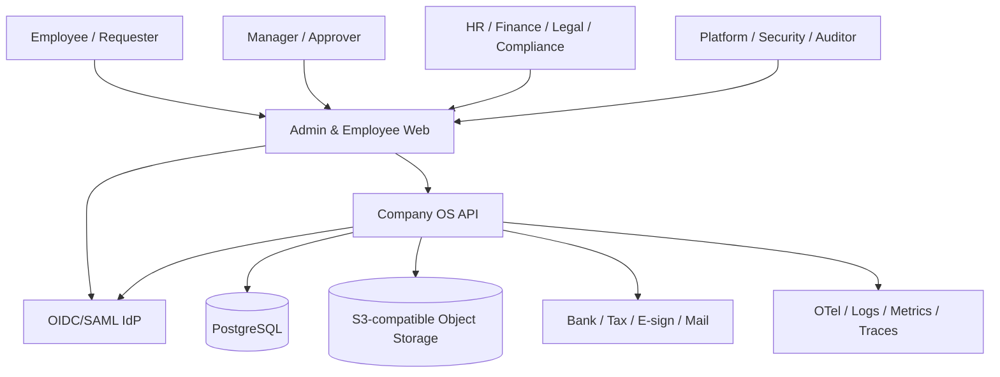
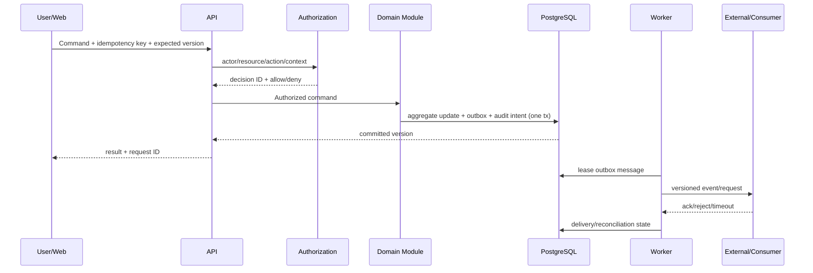

# TASK-006: Architecture Draft

## 1. 状態

- 状態: **Milestone 0 Architecture v0.1 / ADR-001〜006で決定済み**
- 基準日: 2026-08-09
- 対象: Phase 1〜4。Full Payroll、Retail、SaaS control planeは拡張pointのみ。
- Deployment: DEV/SMBを実装対象、ENTは参照architecture。

## 2. Quality attribute priorities

1. Authorization / Privacy / SoD correctness
2. Accounting / compliance rule reproducibility and auditability
3. Data integrity, correction, retention, restore
4. Developer velocity and local reproducibility
5. Operability and external-integration recovery
6. SMB performance and cost
7. Future module extraction / multi-tenant evolution

## 3. System context



## 4. Container view

| Container | Responsibility | Technology | Trust/Data boundary |
| --- | --- | --- | --- |
| Web | admin/employee UI、accessibility、BFFなしのAPI client | Next.js Active LTS | browser token handling、CSP/CSRF/XSS |
| API | application command/query、domain modules、authz、audit intent | NestJS + Fastify + TypeScript | tenant/resource/purpose policy |
| Worker | outbox delivery、notification、export、retention、reconciliation | same codebase/separate process | bounded concurrency、lease/idempotency |
| PostgreSQL | context schemas、outbox/inbox、read model | PostgreSQL supported major | schema owner roles、PITR/backup |
| Object storage | encrypted document binary | S3-compatible | quarantine/available buckets/prefixes |
| IdP | authentication、MFA、federation、credential | Keycloak/Managed IdP | credentialはCompany OS外 |
| Scanner | attachment malware assessment | external process/service | raw upload隔離 |
| OTel Collector | telemetry routing/redaction/buffering | OpenTelemetry | C4 payload禁止 |

APIとWorkerは同一artifactを異なるentrypointで起動できる。DEVでは一processも許すが、productionではinteractive latencyとbatch failure isolationのため分離する。

## 5. Module architecture

```text
apps/
  web/
  api/
  worker/
modules/
  party/ organization/ authorization/ workflow/
  documents/ compliance/ records/ audit/ integration/
  workforce/ time/
  supplier/ purchasing/ expense/ payables/ payments/
  ledger/ receivables/ costing/
packages/
  kernel/ contracts/ testing/ observability/ ui/
```

各module:

```text
<module>/
  domain/          # aggregate, value, domain service/event
  application/     # command/query/use case, port
  infrastructure/  # persistence/external adapter
  api/             # HTTP/event public contract adapter
  index.ts          # 唯一のpublic import surface
```

依存方向は`api/infrastructure → application → domain`。domainはNestJS、ORM、HTTP、queueをimportしない。`packages/kernel`はID、Money interface、clock/result等の小さなprimitiveのみとし、business entityを置かない。

## 6. Data architecture

- PostgreSQL cluster/databaseは初期共有、contextごとにschemaとapplication DB roleを論理分離。
- writeはowner repositoryのみ。他context tableへのwrite/importをarchitecture/static testで禁止。
- cross-context IDにDB FKを原則置かず、owner eventからlocal projection/versionを維持。
- transactionはaggregate + outbox + audit intentまで。Audit Ledger配送失敗時のP0 commandはpolicyによりfail closed。
- reportingはevent-fed read model。source watermark/classificationを持つ。
- object binaryはDBへ格納せず、checksum/version/object refをDocument aggregateが所有。

## 7. Request flow



queryもserver-side authorizationを通る。bulk exportはrequestを作成し、追加承認、async job、期限付きdownloadを使用する。

## 8. Authentication and authorization

- BrowserはAuthorization Code + PKCE。productionはMFA policyをIdPで強制。
- APIはissuer/audience/signature/timeを検証し、external subjectをinternal identity linkへ解決。
- authentication claim/groupをbusiness permissionへ直接変換しない。
- SYS-AUT-001がRBAC + resource/tenant/org/purpose attributes + dynamic SoDを評価。
- deny/undeterminedを区別して監査するが、client responseは情報漏洩しないerrorに正規化。
- service-to-serviceはworkload identity/mTLSをprofile別に採用し、static long-lived secretを避ける。

## 9. Rule, audit, retention

### Rule

YAML/JSON DSL + typed evaluatorを採用し、任意code executionを許さない。source、effective period、applicability、input/output schema、test version、review/publish署名をRuleVersionへ含める。

### Audit

domain DB transactionへaudit intentを記録し、Audit moduleがclassification-aware eventへ正規化する。payloadを全複製せず、allowlisted fields、before/after digest/ref、decision/rule versionを保持する。定期integrity checkpointを独立storage/SIEMへexportする。

### Retention

record ownerがRecordDeclarationを発行し、Records moduleがschedule/holdを評価してDispositionBatchを作る。実際のdeleteはowner moduleが実行し、search/cache/object/read modelへcascade commandを送り、部分結果を追跡する。

## 10. Integration reliability

- at-least-once delivery + idempotent consumer。exactly-onceを主張しない。
- internal eventはPostgreSQL outboxから開始。pollingは`FOR UPDATE SKIP LOCKED`相当、lease/attempt/backoff/next_atを持つ。
- external状態はrequested/transmitted/acknowledged/rejected/unknown/reconciledを分離。
- timeout後のpayment/e-sign/tax filingをblind retryしない。
- DLQは終端ではなくReconciliationCaseとoperator runbookへの入口。

## 11. Deployment profiles

### DEV

Docker ComposeでWeb/API/Worker/PostgreSQL/MinIO/Keycloak/Mailpit/OTel Collector。sample secretは`.env.example`のplaceholderだけをversion管理し、実値はgenerated local file。

### SMB

managed containerまたはVM container、managed PostgreSQL PITR、managed object/KMS/secrets、CDN/WAF、KeycloakまたはManaged IdP。single regionを既定にし、documented restoreでRPO≤24h/RTO≤8hを検証。

### ENT reference

Kubernetes/Helm、HA database、private networking、enterprise IdP/KMS/SIEM、multi-AZ/DR option。実環境のSLA/DR testなしに「Enterprise ready」と表示しない。

## 12. Observability

- request/job/event/external attemptにcorrelation/causation ID。
- API RED、resource USE、queue lag/oldest age、outbox retry、reconciliation age、authz deny、audit gap、rule verification age、backup/restore metrics。
- business alert: reporting deadline、overtime threshold、unmatched payment、period close blocking、hold conflict。
- log/tracesへtoken、document body、bank detail、C4 fieldを出さない。error objectはclassification-aware sanitizerを通す。

## 13. Migration, release, rollback

1. schemaはexpand→backfill→application switch→contract。
2. old/new applicationが共存できないmigrationはmaintenance windowとrestore/forward-fix rehearsalを要求。
3. rule/config/UI/API/schemaを独立version化し、release manifestで対応関係を固定。
4. P0 external actionのrollbackはstate rewindではなくcompensating action/reconciliation。
5. artifact rollback後も新schemaを読めるcompatibility windowを最低1 release維持。

## 14. Security boundary summary

- C4 modules/index/key/accessは分離可能な設計にし、汎用polymorphic attachment/commentを禁止。
- arbitrary URL fetch、archive extraction、dynamic rule code、raw SQL importをdefault禁止。
- tenant contextはrequest入力値ではなくverified identity + server routeから確立。
- platform/support adminにbusiness data閲覧を暗黙付与しない。
- delete/restore/payment/policy publishはdual controlとfailure injection testが必要。

## 15. Architecture fitness functions

| Fitness ID | Check |
| --- | --- |
| FIT-ARCH-001 | module public surface以外のcross-module importを失敗させる |
| FIT-ARCH-002 | domain layerからframework/ORM/network importを失敗させる |
| FIT-DATA-001 | owner以外のschema write grant/migrationを失敗させる |
| FIT-AUTH-001 | command/query routeにauthorization metadata/guardがない場合失敗 |
| FIT-AUD-001 | P0 commandにaudit specification/testがない場合失敗 |
| FIT-EVT-001 | event schema互換性とidempotency testがない場合失敗 |
| FIT-COMP-001 | verified Requirementにsource/effective/test/trace linkがない場合失敗 |
| FIT-PRV-001 | C4 fixture markerがlog/event/exportへ出たら失敗 |
| FIT-MIG-001 | migration apply/rollback-or-forward/clean schema diffが失敗したら失敗 |

## 16. 受け入れ条件

- [x] Container、module、data、trust、request/event flowを定義した。
- [x] Domain Modelの19 contextを配置可能なmodule方針を示した。
- [x] transaction、external failure、migration、rollback、restoreを定義した。
- [x] DEV/SMB/ENT profileを分離した。
- [x] Security/Privacy/SoD/Audit/Retentionをarchitectureへ組み込んだ。
- [x] 実装で境界を検査するfitness functionを定義した。
Post-Milestone gate: TASK-007 vertical sliceでfitness functionとNFRを実証する（pending）。
