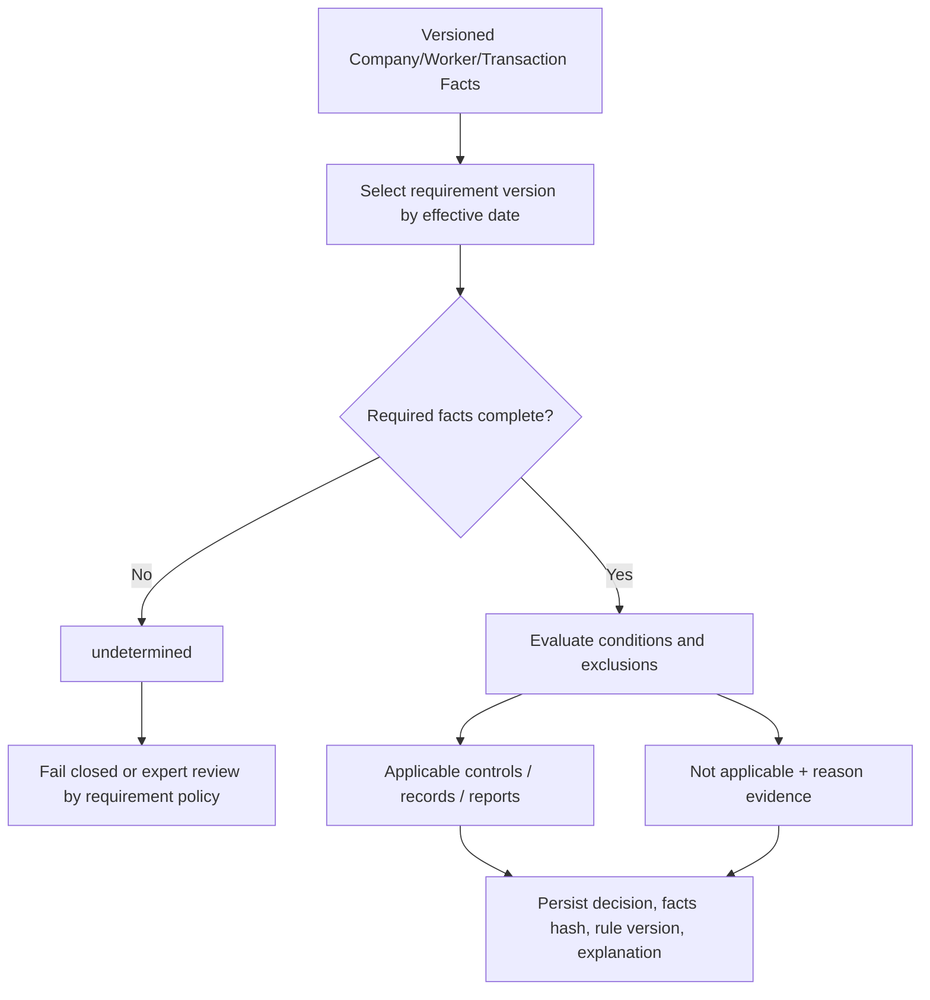

# Applicability Matrix

## 状態

- 基準日: 2026-08-09
- 状態: **初期版 / 要専門家レビュー**
- 目的: 法令の結論を会社単位のbooleanへ潰さず、適用判断に必要なfactsと結果を定義する。

## 判定値

`applicable` / `not_applicable` / `undetermined` / `expert_review_required`を使用する。情報不足を`false`として扱わない。

## Company Profile facts

| Fact ID | Scope | 型 | 例 | Owner | 機微性 |
| --- | --- | --- | --- | --- | --- |
| FACT-ORG-LEGAL-FORM | LegalEntity | code + effective period | corporation | SYS-ORG-001 | C1 |
| FACT-ORG-JURISDICTION | LegalEntity/Establishment | jurisdiction code | JP-13 | SYS-ORG-001 | C1 |
| FACT-ORG-TAX-STATUS | LegalEntity/FiscalPeriod | versioned code | taxable corporation | SYS-TAX-001 | C3 |
| FACT-ORG-INVOICE-REG | LegalEntity/Period | registration status/id | registered | SYS-TAX-001 | C2 |
| FACT-EST-WORKER-COUNT | Establishment/Date | integer + counting rule | 120 | SYS-HR-001 | C2 |
| FACT-WKR-EMPLOYMENT | Worker/Period | employment classification | employee | SYS-HR-001 | C3 |
| FACT-WKR-WORK-SYSTEM | Worker/Period | work system code | standard | SYS-TIM-001 | C3 |
| FACT-EST-36-AGREEMENT | Establishment/Period | agreement/version/status | filed | SYS-TIM-001 | C2 |
| FACT-TXN-ELECTRONIC | Transaction | boolean + channel | email invoice | domain SoR | C2 |
| FACT-DATA-SHARING | Processing event | recipient/purpose/basis | third party | SYS-PRV-001 | C4 |
| FACT-INCIDENT-CATEGORY | Incident | categories/count | sensitive/1200 | SYS-SEC-001 | C4 |
| FACT-FY-LOSS | LegalEntity/FiscalYear | loss category | blue return loss | SYS-GL-001/SYS-TAX-001 | C3 |

## Requirement matrix

| Requirement | Subject scope | Required facts | Applicability expression | 不明時 | Output controls |
| --- | --- | --- | --- | --- | --- |
| JP-LABOR-001 | Worker/leave period | employment, leave grant, base date | leave was granted under applicable labor rule | expert_review_required | CTL-LABOR-LEAVE-001 |
| JP-LABOR-002 | Employer/record | employment, record type, trigger | entity employs worker and record is covered labor record | applicable unless documented exclusion | CTL-LABOR-RECORD-001 |
| JP-LABOR-003 | Establishment/worker/period | jurisdiction, work system, agreement, industry/job exception, accumulated time | overtime/holiday work is planned or recorded and no exclusion applies | block overtime authorization; expert review | CTL-LABOR-OVERTIME-001 |
| JP-PRIVACY-001 | Incident | controller/processor role, data category, harm, intent, subject count | any reportable category under PPC rule is true | incident remains open; privacy review | CTL-PRIV-INCIDENT-001 |
| JP-PRIVACY-002 | Disclosure/receipt | party roles, legal basis, recipient, provision type | third-party transfer and no statutory exclusion | block transfer | CTL-PRIV-SHARING-001 |
| JP-TAX-001 | Electronic transaction | taxpayer status, channel, transaction-information content | tax record keeper exchanges transaction information electronically | preserve defensively; tax review | CTL-TAX-ERECORD-001 |
| JP-TAX-002 | LegalEntity/fiscal year | corporate status, filing due date, loss/disaster condition, FY start | entity is corporation; retention variant selected from fiscal facts | retain maximum candidate period | CTL-TAX-BOOKS-001 |
| JP-TAX-003 | Invoice/tax period | invoice registration, issuer/recipient role, tax period, issue method | qualified invoice issued/provided or retained for input credit | do not claim qualified status | CTL-TAX-INVOICE-001 |

## 判定フロー

## 不変条件

- 人数条件にはcounting rule IDと基準時点を必須とする。
- `LegalEntity`、`Establishment`、`Worker`、`Transaction`のscopeを混同しない。
- 適用除外には根拠sourceと事実証跡を要求する。
- rule version、入力facts hash、結果、説明、overrideを監査する。
- 法改正後も過去日時点の判定を再現できる。

## 受け入れ条件

- [x] company/establishment/worker/transaction/incidentのscopeを区別した。
- [x] 初期Requirementに必要なfactsと不明時動作を定義した。
- [x] falseとundeterminedを分離した。
- [x] decisionの再現に必要なversion・facts・説明を定義した。
- [x] v0.1 Requirement 8件をmatrixと照合した。
