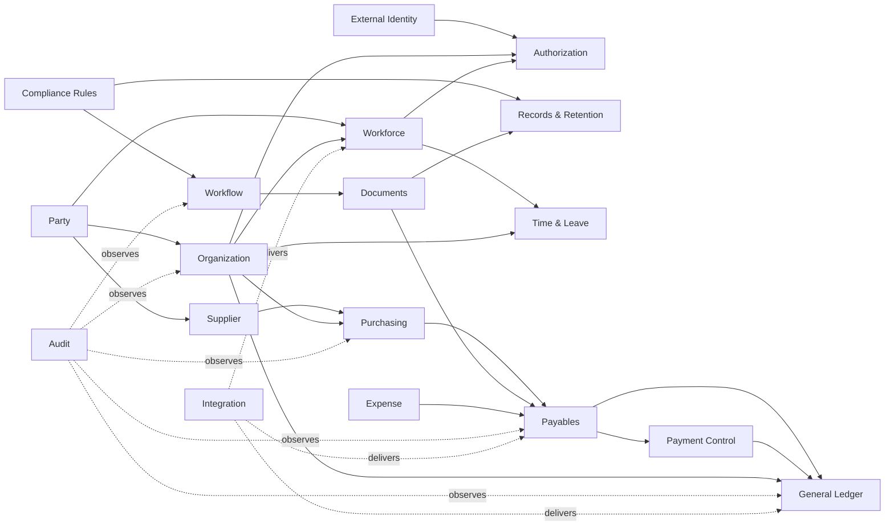

# TASK-005: Phase 1〜4 Domain Model

## 1. 状態と目的

- 状態: **Architecture model v0.1 / 業務・会計・法務専門家レビュー前**
- 基準日: 2026-08-09
- 対象: Phase 1 Platform、Phase 2 HR/Attendance、Phase 3 Expense/Procurement/AP、Phase 4 Accountingおよびそれらを支えるParty/Integration。
- 非対象: Full Payroll、Tax filing、Retail、Manufacturingのaggregate詳細。

本書はlogical modelであり、table設計やORM class一覧ではない。aggregateは同一transactionで不変条件を守る最小単位とし、module/serviceの数とは一致させない。

## 2. モデリング原則

1. IDはtenant内でもglobally uniqueなopaque IDとし、表示codeをidentityに使わない。
2. `tenant_id`、owner context、classification、created/changed actor、versionを全正本に持つ。
3. business effective time（valid time）とsystem knowledge time（transaction time）が必要なaggregateを区別する。
4. 他contextのaggregateはID/referenceで参照し、transaction内join更新しない。
5. monetary valueはamount、ISO currency、rounding/rule referenceの組で扱う。
6. date/timeはbusiness timezoneを明示し、instantはUTC保存、local dateはtimezoneなしの暦日として区別する。
7. posted/issued/executed recordは上書きせず、correction、reversal、superseding versionで是正する。
8. domain eventは確定済みbusiness fact、audit eventは操作証跡、integration messageは配送状態として分離する。
9. soft deleteを保持戦略として乱用せず、Retention/Legal Holdに従う明示的lifecycleを持つ。
10. database foreign keyは同一context内を原則とし、context間整合はAPI/event/reconciliationで確認する。

## 3. Context Map

矢印はupstream情報・command/event関係を示し、database/table依存を意味しない。

## 4. Bounded Context一覧

| Context ID | Context | Phase | Owner System | Owned data | Upstream | Published facts |
| --- | --- | --- | --- | --- | --- | --- |
| BC-PTY | Party | P1 | SYS-PTY-001 | Party, PersonProfile, OrganizationProfile, ContactPoint, Alias | none | PartyRegistered/Merged/Split, ContactVerified |
| BC-ORG | Organization | P1 | SYS-ORG-001 | TenantProfile, LegalEntity, Establishment, OrgUnit, Position, CostCenter, Calendar | Party | Entity/Establishment/OrganizationChanged |
| BC-AUT | Authorization | P1 | SYS-AUT-001 | Policy, PolicyVersion, AccessAssignment, Decision, Elevation | IAM, ORG, WFK projection | PolicyPublished, AccessGranted/Revoked, AccessDecided |
| BC-WFL | Workflow | P1 | SYS-WFL-001 | WorkflowDefinition, WorkflowInstance, ApprovalTask, Decision | AUT, GRC | WorkflowStarted/Decided/Cancelled/Escalated |
| BC-DOC | Documents | P1 | SYS-DOC-001 | Document, DocumentVersion, ObjectRef, ScanAssessment, Link | AUT | DocumentAvailable/Quarantined/Superseded |
| BC-GRC | Compliance | P1 | SYS-GRC-001/SYS-RUL-001 | Requirement, RuleVersion, ApplicabilityDecision, Control, EvidenceLink | official sources, ORG/WKF facts | RulePublished, ApplicabilityDecided, ControlStateChanged |
| BC-RET | Records | P1 | SYS-RET-001 | RetentionSchedule, RecordDeclaration, LegalHold, DispositionBatch | GRC, domain record refs | HoldPlaced/Released, DispositionAuthorized/Completed |
| BC-AUD | Audit | P1 | SYS-AUD-001 | AuditEvent, IntegrityCheckpoint, ExportManifest | all contexts | IntegrityCheckpointCreated |
| BC-INT | Integration | P1 | SYS-INT-001 | OutboxMessage, InboxReceipt, DeliveryAttempt, ReconciliationCase | all contexts/external | DeliveryFailed/Reconciled |
| BC-WKF | Workforce | P2 | SYS-HR-001 | Worker, Employment, Assignment, CompensationTerms | PTY, ORG | Worker/Employment/Assignment/CompensationChanged |
| BC-TIM | Time & Leave | P2 | SYS-TIM-001 | WorkSchedule, AttendanceDay, TimeEntry, LeaveAccount, LeaveRequest, TimePeriodClose | WFK, ORG, GRC | AttendanceApproved, LeaveConsumed, TimePeriodClosed |
| BC-SUP | Supplier | P3 | SYS-SUP-001 | SupplierProfile, Qualification, SupplierBankChangeCase | PTY, GRC | SupplierApproved/Suspended, BankChangeVerified |
| BC-PUR | Purchasing | P3 | SYS-PO-001 | Requisition, PurchaseOrder, Receipt, Inspection, Return | SUP, ORG, WFL | PurchaseOrderIssued, ReceiptAccepted/Rejected |
| BC-EXP | Expense | P3 | SYS-EXP-001 | ExpenseClaim, ExpenseLine, Trip, EvidenceLink, CardTransactionMatch | WFK, ORG, GRC | ExpenseApproved/Rejected |
| BC-AP | Payables | P3 | SYS-AP-001 | SupplierInvoice, MatchCase, Payable, PaymentRequest | PUR, SUP, DOC, EXP | InvoiceApproved, PayableRecognized, PaymentRequested |
| BC-PAY | Payment Control | P3 | SYS-TRY-001 | BankAccountRef, PaymentBatch, PaymentInstruction, BankStatementLine, Reconciliation | AP, external bank | PaymentApproved/Transmitted/Settled/Rejected |
| BC-GL | General Ledger | P4 | SYS-GL-001 | ChartOfAccounts, FiscalPeriod, JournalProposal, JournalEntry, JournalLine, CloseRun | ORG, AP, PAY, other subledgers | JournalPosted/Reversed, PeriodClosed/Reopened |
| BC-AR | Receivables | P4 | SYS-AR-001 | Receivable, Receipt, Allocation, WriteOff | Billing, PAY/bank | ReceivableRecognized, CashApplied, WriteOffApproved |
| BC-CST | Costing | P4 | SYS-CST-001 | AllocationRule, AllocationRun, CostResult | GL, ORG | AllocationCompleted/Superseded |

`SYS-IAM-001`は外部IdPが正本であり、Company OS内にcredential aggregateを置かない。BC-AUTはexternal subject IDとのlinkだけを保持する。

## 5. Aggregate Catalog

### 5.1 Phase 1: Platform

| Aggregate ID | Root | Entities / Value Objects | Lifecycle | Invariants | Requirements / Controls |
| --- | --- | --- | --- | --- | --- |
| AGG-PTY-PARTY | Party | PartyRole, Name, Identifier, Alias | candidate→active→merged/split→retired | typeはPerson/Organizationの一方。mergeは旧ID aliasを保持。tenant越境merge禁止 | NFR-PRV-001 |
| AGG-PTY-CONTACT | ContactPoint | Address, Email, Phone, Verification | unverified→verified→invalid/retired | purpose/source/effective periodを保持。別purposeを暗黙流用しない | JP-PRIVACY-002 |
| AGG-ORG-ENTITY | LegalEntity | RegisteredIdentifier, AddressRef, TaxProfileRef | planned→active→inactive | 同一jurisdictionでidentifier重複禁止。過去version不変 | JP-TAX-002 |
| AGG-ORG-EST | Establishment | Jurisdiction, WorkforceFactRef, CalendarRef | planned→active→closed | legal entityに属す。effective periodsが矛盾しない | JP-LABOR-003 |
| AGG-ORG-STRUCT | OrganizationStructure | OrgUnitVersion, Position, ReportingLine | draft→approved→effective→superseded | 同一時点でcycle禁止。使用済codeを別意味へ再利用しない | SOD-IAM-001 |
| AGG-AUT-POLICY | Policy | PolicyVersion, Rule, Scope | draft→reviewed→published→retired | published version immutable。author != publisher | SOD-IAM-002, NFR-SEC-002 |
| AGG-AUT-ASSIGN | AccessAssignment | SubjectRef, RoleRef, Scope, Validity | requested→approved→active→expired/revoked | request/approve/provision分離。end > start。C4はpurpose/scope必須 | SOD-IAM-001 |
| AGG-AUT-ELEV | Elevation | IncidentRef, Scope, Approval, Expiry | requested→approved→active→expired/revoked | TTL必須。C4/payment/delete/policy publishは単独承認不可 | THR-OPS-001 |
| AGG-WFL-DEF | WorkflowDefinition | WorkflowVersion, Step, Transition, Timer | draft→published→retired | published version immutable。既存instanceは開始versionを継続 | NFR-COMP-001 |
| AGG-WFL-INSTANCE | WorkflowInstance | ApprovalTask, Decision, Delegation | pending→running→approved/rejected/cancelled/expired | task決定は一度。delegation chain cycle禁止。domain commitは別transaction | SOD-* |
| AGG-DOC-DOCUMENT | Document | DocumentVersion, ObjectRef, ScanAssessment, Classification | quarantined→available→superseded→held/disposed | availableにはchecksum/scan/classification必須。version上書き禁止 | JP-TAX-001, THR-FILE-001 |
| AGG-GRC-REQ | Requirement | SourceRef, RequirementVersion, TraceLink | unverified→verified→superseded | verifiedにはofficial source/checked date/reviewer必須 | compliance schema |
| AGG-GRC-RULE | Rule | RuleVersion, EffectivePeriod, TestCaseRef | draft→reviewed→published→retired | effective period overlap禁止。published rule/test不可分 | JP-LABOR-003, NFR-COMP-001 |
| AGG-GRC-DEC | ApplicabilityDecision | FactSnapshotRef, Result, Explanation | evaluated→reviewed/overridden→superseded | unknown factをnot_applicableにしない。rule/input hash必須 | JP-* |
| AGG-RET-SCHED | RetentionSchedule | LegalBasis, Trigger, Period, DispositionMethod | draft→approved→active→superseded | record class/jurisdiction/effective period必須 | JP-LABOR-001/002, JP-TAX-001/002/003 |
| AGG-RET-HOLD | LegalHold | Scope, Custodian, Reason, Approval | proposed→active→released | active holdのscopeは自動廃棄不可。release actor/approval必須 | SOD-RET-001 |
| AGG-RET-DISP | DispositionBatch | CandidateRef, HoldCheck, Approval, Result | proposed→checked→approved→executing→completed/partial | schedule/hold version固定。部分失敗をcompletedにしない | SOD-RET-001, THR-DATA-003 |
| AGG-AUD-EVENT | AuditEvent | ActorRef, Action, ResourceRef, DecisionRef, PayloadDigest | append-only | tenant/actor/time/action/request ID必須。C4 payloadはallowlist | NFR-AUD-001 |
| AGG-INT-MSG | IntegrationMessage | PayloadRef, Attempt, Ack, Error | pending→transmitting→acknowledged/rejected/unknown→reconciled | idempotency key/payload hash固定。timeoutを成功扱いしない | NFR-REL-002/003 |

### 5.2 Phase 2: Workforce & Attendance

| Aggregate ID | Root | Entities / Value Objects | Lifecycle | Invariants | Requirements / Controls |
| --- | --- | --- | --- | --- | --- |
| AGG-WKF-WORKER | Worker | PartyRef, WorkerNumber, Status | proposed→active→inactive | Partyと別identity。worker number再利用禁止 | JP-LABOR-002 |
| AGG-WKF-EMP | Employment | TermsVersion, EmployerRef, WorkerRef, EffectivePeriod | proposed→active→suspended/ended | employer legal entity/period必須。terms変更は新version | JP-LABOR-002 |
| AGG-WKF-ASSIGN | Assignment | OrgUnitRef, PositionRef, CostCenterRef, ManagerRef, FTE | planned→active→ended | employment期間内。主assignmentの期間重複制約をpolicy化 | SOD-HR-001 |
| AGG-WKF-COMP | CompensationTerms | PayBasis, Currency, AllowanceRuleRef, Validity | draft→approved→effective→superseded | amount/currency/effective period/rule必須。HR change != payroll approval | SOD-HR-001 |
| AGG-TIM-SCHED | WorkSchedule | WorkPattern, CalendarRef, DailyPlan | draft→approved→effective→superseded | timezone/calendar固定。employment/work system適用内 | JP-LABOR-003 |
| AGG-TIM-DAY | AttendanceDay | TimeEntry, Break, Source, Correction | open→submitted→approved→locked→corrected | interval overlap禁止。source timezone保持。approved修正は新correction | JP-LABOR-003, SOD-TIME-001 |
| AGG-TIM-LEAVE | LeaveAccount | Grant, Consumption, Adjustment | open→closed | ledger append。残高を直接更新せずentry合計。grant period別追跡 | JP-LABOR-001 |
| AGG-TIM-REQUEST | LeaveRequest | RequestedUnit, Period, Decision | draft→submitted→approved/rejected/cancelled→consumed | self approval禁止。消費とrequestを冪等link | JP-LABOR-001, SOD-TIME-001 |
| AGG-TIM-CLOSE | TimePeriodClose | WorkerResult, Exception, RuleDecisionRef | preparing→review→closed→reopened | unresolved blocking exceptionでclose不可。reopen理由/承認必須 | JP-LABOR-003 |

### 5.3 Phase 3: Expense, Procurement, AP

| Aggregate ID | Root | Entities / Value Objects | Lifecycle | Invariants | Requirements / Controls |
| --- | --- | --- | --- | --- | --- |
| AGG-SUP-PROFILE | SupplierProfile | PartyRef, Status, Qualification, Terms | candidate→review→approved→suspended/ended | approvedにはdue diligence/approver必須 | SOD-PTP-001 |
| AGG-SUP-BANKCASE | SupplierBankChangeCase | OldRef, NewRef, Verification, Hold | requested→verified→approved→effective/rejected | requester != verifier。first payment holdを解除するまで使用不可 | SOD-BANK-001, THR-PAY-001 |
| AGG-PUR-REQ | Requisition | Line, BudgetRef, PolicyDecision, ApprovalRef | draft→submitted→approved/rejected/cancelled→converted | requester != approver。amount/currency/org/supplier条件固定 | SOD-PTP-002 |
| AGG-PUR-PO | PurchaseOrder | OrderLine, SupplierRef, ContractRef, Revision | draft→approved→issued→partially_fulfilled→fulfilled/cancelled | issued revision上書き禁止。変更は新revision/再承認 | SOD-PTP-003 |
| AGG-PUR-RECEIPT | Receipt | ReceiptLine, Inspection, EvidenceRef | draft→received→accepted/rejected→returned | PO line残量超過はtolerance/ruleなしに不可。receiver != PO approver | SOD-PTP-003 |
| AGG-EXP-CLAIM | ExpenseClaim | ExpenseLine, TaxDecisionRef, EvidenceRef, Approval | draft→submitted→approved/rejected→payable/settled | claimant != approver。currency conversion source/date保持 | JP-TAX-001, SOD-PTP-002 |
| AGG-AP-INVOICE | SupplierInvoice | InvoiceLine, TaxDecisionRef, DocumentRef, DuplicateFingerprint | captured→validated→matched/exception→approved/rejected→accounted | supplier/invoice number/date/amount fingerprint重複をhold。approved後上書き禁止 | JP-TAX-001/003 |
| AGG-AP-MATCH | MatchCase | PORef, ReceiptRef, InvoiceRef, Variance, Resolution | pending→matched/exception→resolved | quantity/price/tax tolerance rule version必須。resolver conflict検査 | SOD-PTP-003 |
| AGG-AP-PAYABLE | Payable | ObligationLine, DueDate, Settlement | recognized→partially_settled→settled/disputed/written_off | source approval必須。settlement合計がobligationを超えない | JP-TAX-002 |
| AGG-AP-PAYREQ | PaymentRequest | PayableRefs, Amount, BankRef, Approval | proposed→approved/rejected→batched/cancelled | preparer != approver。bank ref verified。batch後変更不可 | SOD-PAY-001 |
| AGG-PAY-BATCH | PaymentBatch | Instruction, Approval, Transmission | prepared→approved→transmitted→partially_settled/settled/rejected/unknown | batch hash承認後immutable。prepare != approve != execute | SOD-PAY-001, THR-PAY-002 |
| AGG-PAY-RECON | BankReconciliation | StatementLine, CandidateMatch, Resolution | imported→matched/exception→resolved | bank reference + amount + date。manual matchは理由/approver | NFR-REL-003 |

### 5.4 Phase 4: Accounting

| Aggregate ID | Root | Entities / Value Objects | Lifecycle | Invariants | Requirements / Controls |
| --- | --- | --- | --- | --- | --- |
| AGG-GL-COA | ChartOfAccounts | Account, AccountVersion, PostingRule | draft→approved→effective→superseded | account code再利用禁止。posted usage後にtype変更不可 | JP-TAX-002 |
| AGG-GL-PERIOD | FiscalPeriod | LedgerRef, Status, CloseControl | future→open→soft_closed→closed→reopened | closed periodへpost不可。reopenはcontroller承認/理由 | SOD-GL-002 |
| AGG-GL-PROPOSAL | JournalProposal | ProposedLine, SourceRef, RuleRef | received→validated→approved/rejected→posted | source/idempotency一意。debit=credit。currency/rate ref必須 | JP-TAX-002 |
| AGG-GL-JOURNAL | JournalEntry | JournalLine, PostingSequence, ReversalRef | posted→reversed/adjusted | posted line immutable。debit=credit。sequence一意。correctionはnew journal | JP-TAX-002, SOD-GL-001 |
| AGG-GL-CLOSE | CloseRun | ChecklistItem, ReconciliationRef, Certification | preparing→review→completed/failed→superseded | blocking item未完了でclose不可。evidence snapshot固定 | SOD-GL-002 |
| AGG-AR-REC | Receivable | InvoiceRef, DueDate, Balance, Status | recognized→partially_paid→paid/disputed/impaired/written_off | allocation/write-offの合計がoriginal/correctionと整合 | JP-TAX-002/003 |
| AGG-AR-RECEIPT | CashReceipt | BankLineRef, Allocation, UnappliedAmount | imported→unapplied→partially_applied/applied/refunded | allocation合計 + unapplied = receipt amount | SOD-AR-001 |
| AGG-CST-ALLOC | AllocationRun | RuleVersionRef, SourceSnapshot, Result | draft→executed→approved→superseded | source watermark/rule/input hash固定。再実行は新run | NFR-COMP-001 |

## 6. Value Objects

| Value Object | Fields | Invariants |
| --- | --- | --- |
| TenantScopedId | tenant ID, opaque entity ID | tenant mismatch比較/参照を拒否 |
| EffectivePeriod | start inclusive, end exclusive/null | end > start、timezoneを持たないbusiness date |
| Money | integer/decimal amount, currency | floating point禁止、currency scale/ruleを明示 |
| Quantity | decimal, unit | unitなし算術禁止 |
| TaxAmount | Money, tax category, rate/rule version | rule/effective dateなし確定禁止 |
| BusinessInstant | UTC instant, business timezone | local representationを再現可能 |
| Classification | C0-C4, legal/business tags | downgradeはapproval ref必須 |
| ActorContext | subject, identity, role, scope, purpose, decision ID | anonymous commandは許可されたpublic actionのみ |
| SourceReference | system, aggregate ID, version, correlation ID | version/hashで同じsourceを識別 |
| DocumentReference | document ID, version, checksum, classification | mutable URLを正本参照にしない |
| RuleReference | requirement ID, rule ID/version, effective date | published versionのみbusiness確定に使用 |

## 7. 時点管理・訂正・取消

### Valid time / Transaction time

- Organization、Employment、Assignment、Compensation、Policy、Rule、Calendarはvalid timeを持つ。
- 「いつから実務上有効か」と「いつsystemが知ったか」を別に記録する。
- 遡及入力は過去versionを破壊せず、新しいtransaction-time versionでvalid periodを補正する。
- read APIは`as_of_business_date`と、audit用途の`known_at`を区別する。

### Correction model

| Record type | 許可する是正 | 禁止 |
| --- | --- | --- |
| Draft | 同version更新 + optimistic lock | 他actor変更のsilent overwrite |
| Approved but not externally executed | cancel/supersede + re-approval | approval evidenceの書換え |
| Issued document/order/invoice | correction/credit/revision document | 発行番号・元version再利用 |
| Posted journal | reversal + replacement journal | line UPDATE/DELETE |
| Attendance closed | reopen + correction entry + reclose | original clock sourceの削除 |
| External payment | cancel request if supported / compensating refund | timeout後のblind resend |
| Audit event | additive correction reference | payload UPDATE/DELETE |

## 8. Transaction Boundaries

### 同一transaction

- aggregate state、domain event outbox、必須audit intent。
- journal header/lines/balance check/posting sequence。
- leave ledger entryと同aggregateのbalance invariant。
- payment batch hashと承認時のimmutable snapshot。

### 別transaction / eventual consistency

- Workflow decisionとrequesting domainの最終state。
- Document metadataとobject scan provider result。
- Employment変更とIdP/asset provisioning。
- ReceiptとAP match、SupplierInvoiceとGL journal、Paymentとbank acknowledgment。
- Domain eventとreporting/search projection。

### Saga/Process manager候補

| Process | Coordinator | Compensation / Recovery |
| --- | --- | --- |
| Joiner/Mover/Leaver | OnboardingCase | 未完了task、access revoke再試行、manual escalation |
| Purchase-to-Pay | domain events + AP process | PO cancel/return、invoice hold、payment cancel（実行前のみ） |
| Payment transmission | BC-PAY | unknown→reconcile、duplicate禁止、manual resolution |
| Disposition | BC-RET | partial result→retry、restore/delete tombstone、hold再確認 |

分散transactionによるall-or-nothingを仮定しない。外部不可逆actionの前に必要な内部承認とidempotencyを確定する。

## 9. Domain Events

| Event | Producer aggregate | Minimum payload | Consumers |
| --- | --- | --- | --- |
| PartyMerged | AGG-PTY-PARTY | winner/alias IDs, version | domain role contexts, MDM |
| OrganizationChanged | AGG-ORG-STRUCT | changed refs, effective period | WFK, AUT, GL, BI |
| AccessDecided | AGG-AUT-* | decision ID/result/policy version/resource ref | domain, AUD |
| WorkflowDecided | AGG-WFL-INSTANCE | instance/task/result/version | requesting domain |
| RulePublished | AGG-GRC-RULE | rule/version/effective period/hash | RUL cache, tests, domains |
| HoldPlaced | AGG-RET-HOLD | scope/hold ID/effective time | all record owners |
| EmploymentChanged | AGG-WKF-EMP | worker/employment/status/effective period | IAM, TIM, PAY, ASM |
| TimePeriodClosed | AGG-TIM-CLOSE | worker/period/result hash/rule refs | Payroll input, GRC |
| PurchaseOrderIssued | AGG-PUR-PO | PO/revision/supplier/line refs | CLM, receiving |
| ReceiptAccepted | AGG-PUR-RECEIPT | receipt/PO line/quantity | AP, inventory |
| SupplierInvoiceApproved | AGG-AP-INVOICE | invoice/version/amount/tax refs | Payable, GL candidate |
| PaymentSettled | AGG-PAY-BATCH | instruction/bank ref/settled amount/date | AP, AR, GL |
| JournalPosted | AGG-GL-JOURNAL | journal/ledger/period/source ref/hash | BI, TAX, GRC |

payloadはidentifierとconsumerに必要な最小factのみとし、C4値やdocument本文を含めない。

## 10. Cross-context Invariants

cross-context invariantをsingle transactionで強制せず、次の方法を使う。

| Invariant | Pre-command check | Post-commit control |
| --- | --- | --- |
| active workerだけtime entry可 | WFK projection/version確認 | EmploymentChangedでinvalid future entryをexception化 |
| approved supplierだけPO発行可 | SUP status/version確認 | SupplierSuspendedでopen PO review |
| verified bankだけpayment可 | bank verification/version確認 | first-payment reconciliation/alert |
| closed periodへjournal不可 | GL period local check | close-run outstanding proposal check |
| held recordを削除不可 | RET hold local projection/version | disposition直前authoritative recheck |
| policy/SoDを満たすcommandのみ確定 | AUT synchronous decision | audit/reconciliationでdecision link欠落検知 |

## 11. Schema/Migration方針への制約

- contextごとにDB schema namespaceを分け、他context tableへのwrite permissionを与えない。
- shared databaseでもcross-context foreign keyは原則禁止し、reference ID + projection versionを使う。
- event/schemaはbackward compatibleにexpandし、consumer移行後にcontractする。
- nullable追加→backfill→dual-read/write（必要時）→constraint追加の順を基本とする。
- destructive migrationはbackupだけに依存せず、data copy検証、rollback/forward-fix、保持要件を契約化する。

## 12. Traceability examples

| Requirement / Control | Aggregate | Invariant | Test ID |
| --- | --- | --- | --- |
| JP-LABOR-001 | AGG-TIM-LEAVE | grant period別append-only leave ledger | TEST-JP-LABOR-001 |
| JP-LABOR-002 | AGG-WKF-WORKER/EMP | record trigger/effective history保持 | TEST-JP-LABOR-002 |
| JP-LABOR-003 | AGG-TIM-DAY/CLOSE, AGG-GRC-RULE | applicable rolling limits/rule version | TEST-JP-LABOR-003 |
| JP-PRIVACY-002 | AGG-PTY-CONTACT, AGG-GRC-DEC | sharing basis/exclusion/record method | TEST-JP-PRIVACY-002 |
| JP-TAX-001 | AGG-DOC-DOCUMENT, AGG-AP-INVOICE | original/checksum/search metadata/history | TEST-JP-TAX-001 |
| JP-TAX-002 | AGG-GL-JOURNAL/PERIOD | balanced immutable post/reversal | TEST-JP-TAX-002 |
| JP-TAX-003 | AGG-AP-INVOICE | invoice version/issue method/retention trigger | TEST-JP-TAX-003 |
| SOD-PAY-001 | AGG-AP-PAYREQ, AGG-PAY-BATCH | prepare != approve != execute | TEST-SOD-PAY-001 |

## 13. セキュリティ・性能・運用リスク

- effective-dated queryはoverlap検出index/constraintをcontext別に設計し、全履歴scanを避ける。
- Audit/Journal/Leave等のappend ledgerはpartition/archiveを計画し、hash chainだけで改ざん防止を保証したと主張しない。
- C4 contextは汎用document/comment/search tableとpolymorphic associationで接続しない。
- optimistic concurrency versionをcommandへ要求し、last-write-winsを重要aggregateへ使わない。
- projection lagをwatermarkで示し、SoD/hold/paymentのP0判定はstale projectionだけに依存しない。

## 14. 受け入れ条件

- [x] Phase 1〜4のbounded context、owner、owned data、published factsを定義した。
- [x] 各主要aggregateのentity/value、lifecycle、不変条件、Requirement/Controlを定義した。
- [x] Party/Person/Worker/Employment/Identityの同一性を分離した。
- [x] context間の直接DB更新を禁止し、transaction/event境界を定義した。
- [x] valid time、transaction time、訂正、取消、reversalを定義した。
- [x] domain event、audit event、integration messageを分離した。
- [x] 会計・監査データの上書きを禁止し、訂正modelを定義した。
- [x] Requirement IDからaggregate/invariant/testへtrace可能にした。
Post-Milestone gate: 会計・労務・法務専門家によるmodel review（pending）。外部専門家reviewは商用利用または該当module実装前のgateである。
