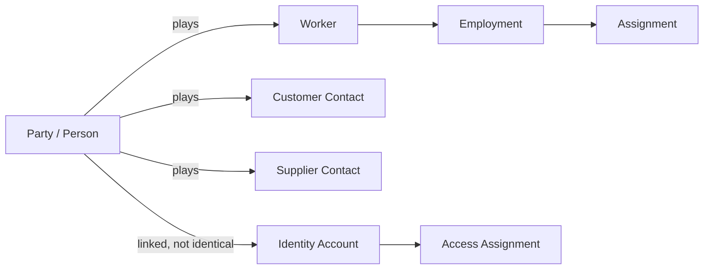

# Master Data Ownership

## 状態と原則

- 状態: **TASK-005と整合確認済み / 業務専門家レビュー前**
- 基準日: 2026-08-09
- 一つのbusiness identifierに一つのauthoritative ownerを置く。
- owner以外はimmutable IDと必要最小限のprojectionを持ち、直接DB更新しない。
- `Party`の存在と`Customer/Supplier/Worker`のroleを分離する。

## Ownership Matrix

| Master ID | Master | Authoritative owner | Steward | Consumers | Change interface | Conflict policy |
| --- | --- | --- | --- | --- | --- | --- |
| MDM-ORG-LEGAL | LegalEntity | SYS-ORG-001 | Corporate admin | 全System | versioned command/event | 登記確認待ちはpending、推測更新禁止 |
| MDM-ORG-EST | Establishment | SYS-ORG-001 | Corporate/HR admin | HR, Time, Tax, GRC | effective-dated command/event | jurisdiction/counting factsを期間管理 |
| MDM-ORG-UNIT | OrgUnit/Position/CostCenter | SYS-ORG-001 | Organization admin/Finance | HR, Authz, Workflow, Finance | reorganization plan + event | 過去assignmentを書換えない |
| MDM-PARTY | Person/Organization identity | SYS-PTY-001 | Data steward | HR, CRM, Supplier, Legal | create/merge/split command | fuzzy matchは候補のみ、自動merge禁止 |
| MDM-CONTACT | ContactPoint | SYS-PTY-001 | Party owner | NTF, CRM, HR | scoped update + verification | source/purposeごとにpreferredを持つ |
| MDM-WORKER | Worker/Employment | SYS-HR-001 | HR | IAM, Time, Payroll, Asset | effective-dated employment event | account状態を雇用正本へ逆流させない |
| MDM-IDENTITY | Identity/Account | SYS-IAM-001 | IAM admin | Authz, Audit | SCIM/OIDC/admin API | Person mergeでaccountを自動統合しない |
| MDM-ACCESS | Role/Policy/Assignment | SYS-AUT-001 | Security owner | 全API | approved policy publish | policy version immutable、deny on ambiguity |
| MDM-CUSTOMER | Customer role/profile | SYS-CRM-001 | Sales operations | Quote, Order, AR, Service | party role command/event | Party属性とcredit/termsを分離 |
| MDM-SUPPLIER | Supplier role/profile | SYS-SUP-001 | Procurement | Sourcing, PO, AP, Contract | approved onboarding/change | bank changeはSYS-TRY-001と二者照合 |
| MDM-BANK | BankAccountRef/Mandate | SYS-TRY-001 | Treasury | AP, Payroll, AR | tokenized reference API | raw口座をconsumerへ複製しない |
| MDM-OFFERING | Product/Service offering | SYS-CPQ-001 | Product owner | Sales, Procurement, Retail | catalog publish event | version/price effective period固定 |
| MDM-RETAIL-SKU | SKU/Assortment | SYS-RTL-001 | Merchandising | POS, EC, Inventory | retail catalog event | common offeringとstock unitを分離 |
| MDM-ACCOUNT | Chart of Accounts/Dimension | SYS-GL-001 | Controller | subledgers, BI | period-aware publish | 使用済account codeを再利用しない |
| MDM-TAX | TaxCategory/Registration | SYS-TAX-001 | Tax specialist | Billing, AP, GL | versioned tax decision API | tax resultをcatalogへhard-codeしない |
| MDM-RULE | Requirement/RuleVersion | SYS-GRC-001/SYS-RUL-001 | Compliance owner | 全domain | reviewed publish event | source失効時undeterminedへ戻す |
| MDM-RETENTION | RetentionSchedule | SYS-RET-001 | Records/privacy owner | 全SoR | approved schedule publish | hold中の短縮を禁止 |
| MDM-CURRENCY | Currency code/precision | platform reference data | Finance steward | 全金額domain | versioned reference package | ISO更新と業務rounding ruleを分離 |
| MDM-CALENDAR | Holiday/Business/Fiscal calendar | SYS-ORG-001 | HR/Finance per calendar | Time, Workflow, Finance | versioned calendar publish | timezone/jurisdictionとセットで解釈 |

## Identity separation

## Change protocol

1. consumerがchange requestをownerへ送る。
2. ownerがvalidation、重複、権限、effective dateを評価する。
3. owner transaction内でmaster versionとoutbox eventを確定する。
4. consumerはevent IDで冪等にprojectionを更新する。
5. 不達はreplayし、ownerを直接参照してreconcileできる。
6. merge/split/correctionは旧IDへのaliasと監査を保持し、履歴を書き換えない。

## 受け入れ条件

- [x] 主要masterに唯一のauthoritative ownerとstewardを割り当てた。
- [x] Party/role/Identity/Employmentを分離した。
- [x] change、event、reconciliation、mergeの規則を定義した。
- [x] System IDと相互参照した。
- [x] TASK-005のaggregate一覧と所有境界を照合した。
