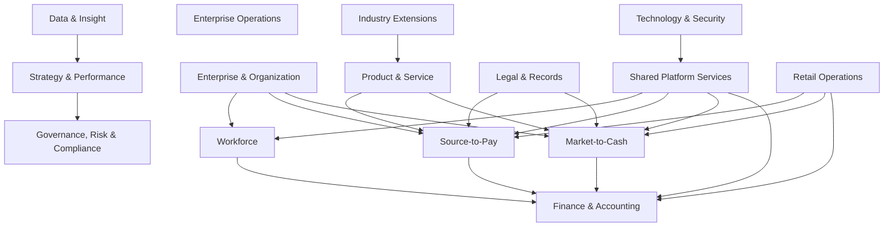

# TASK-002: Business Capability Map

## 1. 目的と状態

Company OSが対象とする「企業が何をできる必要があるか」を、組織図や製品構成から独立してL0〜L3で整理する。

- 文書状態: **確認済み（構想内の網羅性）**
- 法令上の必須性: **未確認（TASK-004で判定）**
- 業務専門家レビュー: **要レビュー**
- 基準日: 2026-08-08

このマップへの収録は自作を意味しない。実現手段はTASK-003でBuild / Buy / Integrateに分類する。

## 2. 分類規則

| Level | 定義 | 例 | 禁止する混在 |
| --- | --- | --- | --- |
| L0 | 企業価値を支える最上位の能力領域 | Workforce | 部署名、製品名 |
| L1 | end-to-endの成果または継続的な経営責任 | Employ Workforce | 個別画面、帳票 |
| L2 | 一つの業務成果を持つ安定した能力 | Manage Employment | DB entity、API |
| L3 | 手順・統制・自動化へ割り当て可能な能力 | Maintain Employment Terms | CRUD操作だけの分割 |

ID形式は `CAP-<L0略号>-<L1番号>-<L2番号>-<L3番号>` とする。上位能力は未使用桁を`00`にする。IDは名称変更後も再利用しない。

表のL3列はセミコロン区切りの順に`01`から採番する。例えば
`CAP-STR-01-01-00 Manage Strategy`の`Define objectives`は
`CAP-STR-01-01-01`、`Maintain initiatives`は`CAP-STR-01-01-02`である。
L3を廃止しても番号を詰めず、並べ替え時も既存番号を維持する。TASK-003の機械可読カタログでは派生IDを明示的な行として展開する。

## 3. L0マップ

| ID | L0能力 | 主な企業成果 | 区分 |
| --- | --- | --- | --- |
| CAP-STR-00-00-00 | Strategy & Performance | 戦略、計画、業績を整合させる | 共通コア |
| CAP-GOV-00-00-00 | Governance, Risk & Compliance | 意思決定、法令遵守、リスクを統制する | 共通コア |
| CAP-ORG-00-00-00 | Enterprise & Organization | 法人、組織、権限構造を維持する | 共通コア |
| CAP-WKF-00-00-00 | Workforce | 人材を獲得、雇用、配置、育成、退出させる | 共通コア |
| CAP-FIN-00-00-00 | Finance & Accounting | 資金、取引、会計、税務を正確に管理する | 共通コア |
| CAP-PTP-00-00-00 | Source-to-Pay | 供給者選定から支払までを管理する | 共通コア |
| CAP-OTC-00-00-00 | Market-to-Cash | 市場・顧客獲得から回収までを管理する | 共通コア |
| CAP-PRD-00-00-00 | Product & Service | 商品・サービスのライフサイクルを管理する | 共通コア |
| CAP-LGL-00-00-00 | Legal & Records | 契約、法務案件、記録、証拠を管理する | 共通コア |
| CAP-TEC-00-00-00 | Technology & Security | ITサービス、資産、identity、安全性を管理する | 共通コア |
| CAP-OPS-00-00-00 | Enterprise Operations | 施設、総務、プロジェクト、継続性を管理する | 共通コア |
| CAP-DAT-00-00-00 | Data & Insight | データ品質、分析、報告を管理する | 共通コア |
| CAP-COM-00-00-00 | Shared Platform Services | 横断workflow、通知、文書、audit等を提供する | 実現基盤 |
| CAP-RTL-00-00-00 | Retail Operations | 店舗・在庫・POSを運営する | 小売拡張 |
| CAP-IND-00-00-00 | Industry Extensions | 製造・サービス・規制業種能力を追加する | 将来拡張 |

## 4. 全体図

矢印はデータベース依存ではなく、業務成果または情報の供給関係を示す。

## 5. L1〜L3能力

### CAP-STR: Strategy & Performance

| L1 | L2 | L3能力 |
| --- | --- | --- |
| CAP-STR-01-00-00 Set Direction | CAP-STR-01-01-00 Manage Strategy | Define objectives; maintain initiatives; record assumptions and decisions |
| CAP-STR-02-00-00 Plan Enterprise | CAP-STR-02-01-00 Plan Resources | Plan workforce; plan capital; plan operating expense |
| CAP-STR-02-00-00 Plan Enterprise | CAP-STR-02-02-00 Budget & Forecast | Set budget; revise forecast; run scenarios |
| CAP-STR-03-00-00 Manage Performance | CAP-STR-03-01-00 Measure Performance | Define KPI; compare plan/actual; explain variance |
| CAP-STR-03-00-00 Manage Performance | CAP-STR-03-02-00 Report Management | Produce management pack; certify figures; distribute reports |

### CAP-GOV: Governance, Risk & Compliance

| L1 | L2 | L3能力 |
| --- | --- | --- |
| CAP-GOV-01-00-00 Govern Corporation | CAP-GOV-01-01-00 Manage Shareholders & Equity | Maintain shareholder register; manage shares; support shareholder meetings |
| CAP-GOV-01-00-00 Govern Corporation | CAP-GOV-01-02-00 Manage Boards & Officers | Appoint officers; schedule meetings; record resolutions and minutes |
| CAP-GOV-01-00-00 Govern Corporation | CAP-GOV-01-03-00 Manage Authority | Maintain delegation; execute approvals; evidence decisions |
| CAP-GOV-02-00-00 Manage Policy & Compliance | CAP-GOV-02-01-00 Manage Policies | Draft; review; approve; publish; attest; retire policy versions |
| CAP-GOV-02-00-00 Manage Policy & Compliance | CAP-GOV-02-02-00 Manage Obligations | discover requirements; determine applicability; map controls; track evidence |
| CAP-GOV-02-00-00 Manage Policy & Compliance | CAP-GOV-02-03-00 Manage Regulatory Filings | plan filings; prepare submissions; evidence acceptance; track licenses |
| CAP-GOV-03-00-00 Manage Risk & Assurance | CAP-GOV-03-01-00 Manage Enterprise Risk | identify; assess; treat; accept; monitor risks |
| CAP-GOV-03-00-00 Manage Risk & Assurance | CAP-GOV-03-02-00 Manage Controls | design controls; assign owners; test operation; remediate deficiencies |
| CAP-GOV-03-00-00 Manage Risk & Assurance | CAP-GOV-03-03-00 Conduct Audit | plan audit; collect evidence; record findings; follow remediation |
| CAP-GOV-03-00-00 Manage Risk & Assurance | CAP-GOV-03-04-00 Speak-up & Investigations | receive protected report; restrict access; investigate; protect reporter |

### CAP-ORG: Enterprise & Organization

| L1 | L2 | L3能力 |
| --- | --- | --- |
| CAP-ORG-01-00-00 Manage Enterprise Structure | CAP-ORG-01-01-00 Manage Legal Entities | establish entity; maintain registry facts; close entity |
| CAP-ORG-01-00-00 Manage Enterprise Structure | CAP-ORG-01-02-00 Manage Establishments | register place of business; maintain jurisdiction and workforce facts |
| CAP-ORG-01-00-00 Manage Enterprise Structure | CAP-ORG-01-03-00 Manage Organization | maintain units; positions; reporting lines; effective-dated reorganizations |
| CAP-ORG-01-00-00 Manage Enterprise Structure | CAP-ORG-01-04-00 Manage Dimensions | maintain cost centers; projects; fiscal periods; business segments |
| CAP-ORG-02-00-00 Manage Parties | CAP-ORG-02-01-00 Resolve Party Identity | register person/organization; deduplicate; relate roles |
| CAP-ORG-02-00-00 Manage Parties | CAP-ORG-02-02-00 Manage Addresses & Contacts | validate; version; restrict; retire contact points |

### CAP-WKF: Workforce

| L1 | L2 | L3能力 |
| --- | --- | --- |
| CAP-WKF-01-00-00 Plan Workforce | CAP-WKF-01-01-00 Plan Positions & Capacity | forecast demand; approve positions; plan labor cost |
| CAP-WKF-02-00-00 Acquire Talent | CAP-WKF-02-01-00 Recruit | source candidates; manage applications; interview; decide offer |
| CAP-WKF-02-00-00 Acquire Talent | CAP-WKF-02-02-00 Onboard | collect terms; verify prerequisites; provision access/assets; orient worker |
| CAP-WKF-03-00-00 Employ Workforce | CAP-WKF-03-01-00 Manage Employment | maintain contract; assignment; compensation; status changes |
| CAP-WKF-03-00-00 Employ Workforce | CAP-WKF-03-02-00 Maintain Employee Records | maintain ledger; qualifications; benefits; sensitive attributes |
| CAP-WKF-04-00-00 Manage Time & Leave | CAP-WKF-04-01-00 Plan Work | define calendar; schedule; shift; work arrangement |
| CAP-WKF-04-00-00 Manage Time & Leave | CAP-WKF-04-02-00 Record Attendance | clock; record break; correct record; approve time |
| CAP-WKF-04-00-00 Manage Time & Leave | CAP-WKF-04-03-00 Control Working Time | calculate overtime/night/holiday; monitor limits; close period |
| CAP-WKF-04-00-00 Manage Time & Leave | CAP-WKF-04-04-00 Manage Leave | accrue; request; approve; consume; report leave |
| CAP-WKF-05-00-00 Develop & Reward | CAP-WKF-05-01-00 Manage Performance & Goals | set goals; review; calibrate; record outcome |
| CAP-WKF-05-00-00 Develop & Reward | CAP-WKF-05-02-00 Manage Skills & Learning | assess skill; track qualification; assign and evidence training |
| CAP-WKF-05-00-00 Develop & Reward | CAP-WKF-05-03-00 Administer Benefits | enroll; change; terminate benefit participation |
| CAP-WKF-06-00-00 Protect Workforce | CAP-WKF-06-01-00 Manage Health & Safety | plan examination; manage safety case; coordinate occupational health |
| CAP-WKF-06-00-00 Protect Workforce | CAP-WKF-06-02-00 Manage Employee Relations | consultation; labor agreement; grievance; harassment case |
| CAP-WKF-07-00-00 Separate Workforce | CAP-WKF-07-01-00 Offboard | settle employment; recover assets; revoke access; preserve records |

### CAP-FIN: Finance & Accounting

| L1 | L2 | L3能力 |
| --- | --- | --- |
| CAP-FIN-01-00-00 Record-to-Report | CAP-FIN-01-01-00 Manage Chart & Period | maintain accounts; dimensions; calendars; period controls |
| CAP-FIN-01-00-00 Record-to-Report | CAP-FIN-01-02-00 Manage Journals | propose; validate; approve; post; reverse journal |
| CAP-FIN-01-00-00 Record-to-Report | CAP-FIN-01-03-00 Close & Consolidate | reconcile; close; reopen; consolidate; certify |
| CAP-FIN-01-00-00 Record-to-Report | CAP-FIN-01-04-00 Produce Statements | trial balance; ledger; balance sheet; P&L; cash flow |
| CAP-FIN-02-00-00 Manage Receivables | CAP-FIN-02-01-00 Account for Receivables | recognize; age; collect; apply cash; impair/write off |
| CAP-FIN-03-00-00 Manage Payables | CAP-FIN-03-01-00 Account for Payables | record liability; schedule; settle; reconcile payable |
| CAP-FIN-04-00-00 Manage Assets & Cost | CAP-FIN-04-01-00 Manage Fixed Assets & Leases | capitalize; depreciate; impair; transfer; dispose |
| CAP-FIN-04-00-00 Manage Assets & Cost | CAP-FIN-04-02-00 Manage Cost Accounting | allocate; calculate cost; analyze profitability |
| CAP-FIN-05-00-00 Manage Treasury | CAP-FIN-05-01-00 Manage Cash & Banking | maintain bank mandate; forecast cash; reconcile bank; control liquidity |
| CAP-FIN-05-00-00 Manage Treasury | CAP-FIN-05-02-00 Execute Payments | prepare instruction; approve; transmit; confirm; recall where possible |
| CAP-FIN-06-00-00 Administer Payroll | CAP-FIN-06-01-00 Calculate Payroll | calculate earning/deduction; retroactivity; rounding; explain result |
| CAP-FIN-06-00-00 Administer Payroll | CAP-FIN-06-02-00 Settle & Report Payroll | approve payroll; pay; issue statements; produce statutory outputs |
| CAP-FIN-07-00-00 Manage Tax | CAP-FIN-07-01-00 Determine Tax | classify transaction; calculate tax; manage versioned rules |
| CAP-FIN-07-00-00 Manage Tax | CAP-FIN-07-02-00 Report & File Tax | prepare returns; export data; reconcile filing; preserve evidence |

### CAP-PTP: Source-to-Pay

| L1 | L2 | L3能力 |
| --- | --- | --- |
| CAP-PTP-01-00-00 Manage Suppliers | CAP-PTP-01-01-00 Onboard & Govern Supplier | due diligence; approve master; manage bank change; assess performance; offboard |
| CAP-PTP-02-00-00 Source Goods & Services | CAP-PTP-02-01-00 Source | request quote; compare bids; select supplier; evidence conflict check |
| CAP-PTP-03-00-00 Procure | CAP-PTP-03-01-00 Requisition | request purchase; check budget/policy; approve |
| CAP-PTP-03-00-00 Procure | CAP-PTP-03-02-00 Purchase Order | create; approve; issue; amend; cancel order |
| CAP-PTP-04-00-00 Receive | CAP-PTP-04-01-00 Receive & Inspect | record receipt; inspect; accept/reject; return |
| CAP-PTP-05-00-00 Invoice-to-Pay | CAP-PTP-05-01-00 Capture Supplier Invoice | receive; classify; validate; preserve evidence |
| CAP-PTP-05-00-00 Invoice-to-Pay | CAP-PTP-05-02-00 Match & Approve | two/three-way match; resolve exception; approve liability/payment request |
| CAP-PTP-06-00-00 Manage Expense & Travel | CAP-PTP-06-01-00 Expense | set policy; submit claim; validate evidence; approve; reimburse |
| CAP-PTP-06-00-00 Manage Expense & Travel | CAP-PTP-06-02-00 Travel | request travel; book/integrate; manage advance; settle trip |

### CAP-OTC: Market-to-Cash

| L1 | L2 | L3能力 |
| --- | --- | --- |
| CAP-OTC-01-00-00 Manage Market & Leads | CAP-OTC-01-01-00 Manage Leads | capture; qualify; consent; route; convert lead |
| CAP-OTC-02-00-00 Manage Customers | CAP-OTC-02-01-00 Onboard Customer | identify; assess credit/risk; approve account; maintain contacts |
| CAP-OTC-03-00-00 Sell | CAP-OTC-03-01-00 Manage Opportunity | qualify; forecast; collaborate; close opportunity |
| CAP-OTC-03-00-00 Sell | CAP-OTC-03-02-00 Quote & Price | configure offering; price; discount approval; issue quote |
| CAP-OTC-04-00-00 Order-to-Revenue | CAP-OTC-04-01-00 Manage Order | accept; validate; amend; cancel order |
| CAP-OTC-04-00-00 Order-to-Revenue | CAP-OTC-04-02-00 Deliver & Accept | fulfill; deliver; capture customer acceptance; manage return |
| CAP-OTC-04-00-00 Order-to-Revenue | CAP-OTC-04-03-00 Recognize Revenue | identify obligation; recognize; defer; adjust revenue |
| CAP-OTC-05-00-00 Bill-to-Cash | CAP-OTC-05-01-00 Bill Customer | create invoice; deliver; correct; credit/refund |
| CAP-OTC-05-00-00 Bill-to-Cash | CAP-OTC-05-02-00 Collect | receive payment; apply; reconcile; remind; escalate debt |
| CAP-OTC-06-00-00 Serve Customers | CAP-OTC-06-01-00 Manage Service Cases | receive inquiry/complaint; classify; meet SLA; resolve; evidence response |
| CAP-OTC-06-00-00 Serve Customers | CAP-OTC-06-02-00 Manage Subscription | activate; meter entitlement; renew; change; cancel subscription |

### CAP-PRD: Product & Service

| L1 | L2 | L3能力 |
| --- | --- | --- |
| CAP-PRD-01-00-00 Manage Offerings | CAP-PRD-01-01-00 Manage Catalog | define product/service; classify; version; retire |
| CAP-PRD-01-00-00 Manage Offerings | CAP-PRD-01-02-00 Manage Price | define price list; effective dates; promotion; approval |
| CAP-PRD-02-00-00 Manage Lifecycle & Quality | CAP-PRD-02-01-00 Govern Lifecycle | propose; approve; launch; change; discontinue offering |
| CAP-PRD-02-00-00 Manage Lifecycle & Quality | CAP-PRD-02-02-00 Manage Quality | define standard; inspect; manage nonconformance; corrective action |

### CAP-LGL: Legal & Records

| L1 | L2 | L3能力 |
| --- | --- | --- |
| CAP-LGL-01-00-00 Manage Contracts | CAP-LGL-01-01-00 Contract Lifecycle | request; draft; review; negotiate; approve; execute; amend; renew; terminate |
| CAP-LGL-02-00-00 Manage Legal Matters | CAP-LGL-02-01-00 Legal Case | intake; assess; assign; preserve privilege; resolve dispute/claim |
| CAP-LGL-02-00-00 Manage Legal Matters | CAP-LGL-02-02-00 Manage Intellectual Property | register; renew; license; monitor IP rights |
| CAP-LGL-03-00-00 Manage Records & Evidence | CAP-LGL-03-01-00 Records Lifecycle | classify record; declare; retain; hold; dispose; evidence disposal |
| CAP-LGL-03-00-00 Manage Records & Evidence | CAP-LGL-03-02-00 Disclosure & Discovery | search; collect; review; export; evidence chain of custody |
| CAP-LGL-04-00-00 Manage Privacy | CAP-LGL-04-01-00 Govern Processing | inventory processing; purpose/basis; consent; sharing; assessment |
| CAP-LGL-04-00-00 Manage Privacy | CAP-LGL-04-02-00 Fulfil Data Rights | identify requester; search; disclose; correct; restrict/delete; evidence response |

### CAP-TEC: Technology & Security

| L1 | L2 | L3能力 |
| --- | --- | --- |
| CAP-TEC-01-00-00 Manage Identity & Access | CAP-TEC-01-01-00 Identity Lifecycle | join; move; leave; federate; authenticate; recover identity |
| CAP-TEC-01-00-00 Manage Identity & Access | CAP-TEC-01-02-00 Access Governance | request; approve; provision; certify; revoke; enforce SoD/PAM |
| CAP-TEC-02-00-00 Manage IT Services | CAP-TEC-02-01-00 Service Operations | request; incident; problem; knowledge; SLA |
| CAP-TEC-02-00-00 Manage IT Services | CAP-TEC-02-02-00 Change & Release | assess; approve; schedule; deploy; validate; rollback change |
| CAP-TEC-03-00-00 Manage Technology Assets | CAP-TEC-03-01-00 Asset & Configuration | discover; assign; inventory; license; maintain CMDB; dispose |
| CAP-TEC-04-00-00 Manage Cybersecurity | CAP-TEC-04-01-00 Security Posture | inventory; vulnerability; patch; exception; training; third-party risk |
| CAP-TEC-04-00-00 Manage Cybersecurity | CAP-TEC-04-02-00 Security Incident | detect; triage; contain; investigate; notify; recover; learn |
| CAP-TEC-04-00-00 Manage Cybersecurity | CAP-TEC-04-03-00 Secrets & Cryptographic Assets | issue; store; rotate; revoke; audit keys/secrets/certificates |

### CAP-OPS: Enterprise Operations

| L1 | L2 | L3能力 |
| --- | --- | --- |
| CAP-OPS-01-00-00 Manage Facilities | CAP-OPS-01-01-00 Facilities & Access | manage site/seat/room; physical access; key/badge; safety supplies |
| CAP-OPS-01-00-00 Manage Facilities | CAP-OPS-01-02-00 General Affairs | mail; seal; vehicle; insurance; supplies; internal requests |
| CAP-OPS-02-00-00 Manage Work | CAP-OPS-02-01-00 Project & Portfolio | select project; plan milestone/resource/budget; monitor risk/change |
| CAP-OPS-02-00-00 Manage Work | CAP-OPS-02-02-00 Task & Work Log | assign task; record work; timesheet; issue; decision |
| CAP-OPS-03-00-00 Ensure Continuity | CAP-OPS-03-01-00 Business Continuity | analyze impact; plan fallback; communicate crisis; exercise plan |
| CAP-OPS-03-00-00 Ensure Continuity | CAP-OPS-03-02-00 Technology Recovery | define RTO/RPO; backup; restore; fail over; validate recovery |

### CAP-DAT: Data & Insight

| L1 | L2 | L3能力 |
| --- | --- | --- |
| CAP-DAT-01-00-00 Govern Data | CAP-DAT-01-01-00 Master Data Governance | assign owner; define quality; approve change; resolve duplicate |
| CAP-DAT-01-00-00 Govern Data | CAP-DAT-01-02-00 Data Classification & Lineage | classify; catalog; trace source/use; enforce handling |
| CAP-DAT-02-00-00 Deliver Insight | CAP-DAT-02-01-00 Reporting & Analytics | define metric; build report; control access; certify result |
| CAP-DAT-02-00-00 Deliver Insight | CAP-DAT-02-02-00 Data Exchange | import; validate; export; reconcile; track lineage |

### CAP-COM: Shared Platform Services

| L1 | L2 | L3能力 |
| --- | --- | --- |
| CAP-COM-01-00-00 Coordinate Work | CAP-COM-01-01-00 Workflow & Approval | model workflow; assign task; approve/reject; delegate; escalate |
| CAP-COM-01-00-00 Coordinate Work | CAP-COM-01-02-00 Notify & Schedule | deliver notification; manage preference; deadline; reminder; batch/job |
| CAP-COM-02-00-00 Manage Content | CAP-COM-02-01-00 Document & Attachment | upload; scan; version; authorize; render; retrieve object |
| CAP-COM-02-00-00 Manage Content | CAP-COM-02-02-00 Collaboration Metadata | comment; tag; link; annotate without changing domain ownership |
| CAP-COM-03-00-00 Enforce Rules & Evidence | CAP-COM-03-01-00 Rule Evaluation | version; determine applicability; evaluate; explain rule result |
| CAP-COM-03-00-00 Enforce Rules & Evidence | CAP-COM-03-02-00 Audit Capture | capture actor/action/reason/version; protect integrity; search authorized events |
| CAP-COM-03-00-00 Enforce Rules & Evidence | CAP-COM-03-03-00 Retention Execution | calculate disposition; hold; approve; delete; evidence disposal |
| CAP-COM-04-00-00 Integrate Platform | CAP-COM-04-01-00 API & Events | authorize API; publish event; webhook; retry; reconcile |
| CAP-COM-04-00-00 Integrate Platform | CAP-COM-04-02-00 Configure Platform | tenant/profile settings; feature flag; master configuration |

### CAP-RTL: Retail Operations

| L1 | L2 | L3能力 |
| --- | --- | --- |
| CAP-RTL-01-00-00 Manage Retail Network | CAP-RTL-01-01-00 Store Operations | open/close store; maintain store master; control store shift and resources |
| CAP-RTL-02-00-00 Merchandise | CAP-RTL-02-01-00 Merchandise Management | SKU/JAN/category; assortment; cost; price; promotion |
| CAP-RTL-03-00-00 Manage Inventory | CAP-RTL-03-01-00 Inventory Control | receive; transfer; count; adjust; waste; loss; return stock |
| CAP-RTL-04-00-00 Sell Across Channels | CAP-RTL-04-01-00 Point of Sale | transact; tender; return; close register; export accounting result |
| CAP-RTL-04-00-00 Sell Across Channels | CAP-RTL-04-02-00 Omnichannel Commerce | expose stock; accept EC order; orchestrate pickup/delivery/return |
| CAP-RTL-05-00-00 Engage Members | CAP-RTL-05-01-00 Loyalty & Promotion | enroll member; earn/redeem point; coupon; consent; expire liability |
| CAP-RTL-06-00-00 Control Store Performance | CAP-RTL-06-01-00 Store Profitability | allocate revenue/cost; produce store P&L; explain variance |

### CAP-IND: Industry Extensions

| L1 | L2 | L3能力 |
| --- | --- | --- |
| CAP-IND-01-00-00 Manufacture | CAP-IND-01-01-00 Plan & Execute Production | BOM; MRP; production order; operation; lot traceability |
| CAP-IND-01-00-00 Manufacture | CAP-IND-01-02-00 Maintain Equipment | plan maintenance; execute work; record failure and downtime |
| CAP-IND-02-00-00 Deliver Professional Service | CAP-IND-02-01-00 Schedule & Deliver Service | reserve; assign staff; perform work; deliver; accept |
| CAP-IND-03-00-00 Operate Regulated Industry | CAP-IND-03-01-00 Apply Sector Controls | determine sector applicability; license; evidence specialized controls |

## 6. 横断プロセスと能力所有

| 横断プロセス | 起点 | 主な能力 | 正本競合を避ける原則 |
| --- | --- | --- | --- |
| Hire-to-Retire | 採用決定 | WKF, ORG, TEC, OPS, FIN | Person、Employment、Identity、Assetを別aggregateとしてevent連携 |
| Joiner/Mover/Leaver | Employment event | WKF, TEC, OPS | HRは雇用状態、IAMはcredential/access、OPSは物品を所有 |
| Source-to-Pay | 購買需要 | PTP, LGL, FIN, COM | Supplier master、Contract、Invoice、Payment、Journalを分離 |
| Market-to-Cash | lead/order | OTC, PRD, LGL, FIN | Customer role、Order、Invoice、Receipt、Journalを分離 |
| Record-to-Report | subledger event | FIN, DAT, GOV | GLはposted journalを正本とし、業務詳細を複製しない |
| Obligation-to-Evidence | 法令/方針変更 | GOV, LGL, COM, DAT | Requirement、Control、Evidence、Audit Eventを別概念にする |
| Incident-to-Recovery | 検知/通報 | TEC, OPS, GOV, LGL | IT/security/privacy caseは閲覧境界を保ち共通caseへ統合しない |

重複所有は「共有aggregate」を意味しない。各プロセスのorchestrationとread modelが複数能力を横断する。

## 7. 小売拡張の境界

小売固有としてCAP-RTLが所有するのは、Store、SKU assortment、stock ledger、POS transaction、loyalty ledger、store-specific operational closeである。

次は共通コアを再利用する。

- 法人・店舗の法的/組織情報: CAP-ORG
- Supplier、発注、請求: CAP-PTP
- Customer、受注、請求、入金: CAP-OTC
- 商品・価格の共通catalog primitive: CAP-PRD
- 仕訳、店舗別dimension、財務諸表: CAP-FIN
- 店舗従業員、shift、attendance: CAP-WKF
- 承認、文書、rule、audit: CAP-COM

在庫の物理movementと会計評価は同一aggregateにせず、確定したinventory eventから会計側が評価・仕訳する。

## 8. 構想内システム候補のカバレッジ

| 原典の章 | 主な対応Capability | 状態 |
| --- | --- | --- |
| 4 Common Platform | ORG, COM, TEC, DAT, GOV, LGL | 対応済み |
| 5 HR | WKF-01/02/03/05/07 | 対応済み |
| 6 Labor | WKF-04/06, GOV-02 | 対応済み |
| 7 Payroll | FIN-06/07, WKF-04 | 対応済み |
| 8 Accounting | FIN-01〜05, STR-02/03 | 対応済み |
| 9 Tax | FIN-07, GOV-02/03, LGL-03 | 対応済み |
| 10 Procurement | PTP-01〜05, LGL-01, FIN-03/05 | 対応済み |
| 11 Sales | OTC-01〜06, PRD-01, FIN-02 | 対応済み |
| 12 Legal | LGL-01〜04 | 対応済み |
| 13 Governance | GOV-01〜03 | 対応済み |
| 14 Privacy | LGL-04, DAT-01, GOV-02/03 | 対応済み |
| 15 ITSM | TEC-01〜03 | 対応済み |
| 16 Security | TEC-04, GOV-03 | 対応済み |
| 17 BCP/DR | OPS-03 | 対応済み |
| 18 Facilities | OPS-01 | 対応済み |
| 19 Project/Work | OPS-02 | 対応済み |
| 20 Retail | RTL-01〜06 + common core | 対応済み |
| 20 Manufacturing/Service/Regulated | IND-01〜03 | 将来能力として対応 |
| GAP-006追加領域 | STR, FIN-05, OTC-06, PRD, DAT, LGL-03, GOV-02 | 対応済み |

## 9. 非目標

- 会社ごとの部署名へ能力を割り当てること
- 各Capabilityを独立moduleまたはmicroserviceにすること
- 収録した全能力をCompany OSで自作すること
- 法令上の適用条件やMandatory判定を本書だけで確定すること

## 10. リスクと推奨

| リスク | 根拠 | 推奨 |
| --- | --- | --- |
| 能力数が実装範囲と誤認される | 網羅性のため将来能力も含む | TASK-003でMandatory、Build/Buy/Integrate、Phaseを付与 |
| 共通基盤がbusiness domainを所有する | COMに横断機能が集中 | COMは実行primitiveのみ所有し、業務状態を所有しない |
| 機微caseの情報漏洩 | Incidentやtaskの共通化 | case aggregateと検索indexを権限境界ごとに分離 |
| 小売モデルが共通商品モデルを肥大化 | SKU/POS/stockの固有性 | PRDとRTL間をversioned event/APIで接続 |
| L3粒度が領域ごとに揺れる | 調査深度が異なる | System Catalog作成時に不足能力を追加しIDを維持 |

## 11. 受け入れ条件

- [x] L0〜L3の分類規則と安定ID規則を定義した。
- [x] 原典の全システム候補を少なくとも1つの能力へ対応付けた。
- [x] 横断プロセスにおける重複所有と正本分離を明示した。
- [x] 小売拡張と共通コアの境界を明示した。
- [x] MermaidでL0間の主要関係を可視化した。
- [x] 収録と自作判断を分離し、TASK-003への入力を作成した。
Post-Milestone gate: 業務専門家による網羅性・粒度review（pending）。これは商用/実装scope確定前の外部reviewであり、Milestone 0の文書受け入れ条件ではない。
