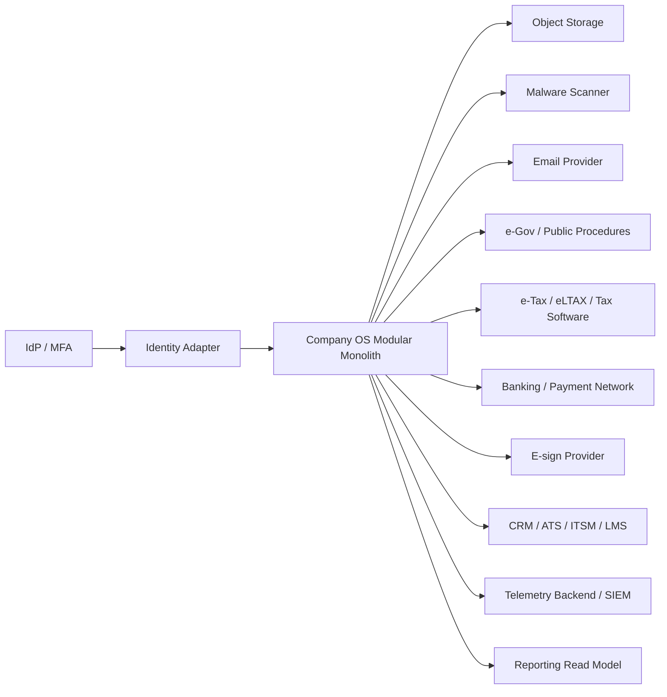

# Integration Map

## 状態と原則

- 状態: **Architecture draft v0.1 / 外部仕様・契約は未確認**
- 基準日: 2026-08-09
- 外部接続の存在を適法性・送信成功・業務完了と同一視しない。
- domain transactionは外部応答を保持したまま長時間lockせず、outbox/inboxとreconciliationで整合させる。

## Context map

## External integration catalog

| INT ID | Provider class | Producer/Consumer | Data | Direction | Protocol候補 | Auth | Completion evidence | Failure/Fallback | Class | Phase |
| --- | --- | --- | --- | --- | --- | --- | --- | --- | --- | --- |
| INT-IDP-001 | IdP/MFA | SYS-IAM-001 | identity、group、auth event | 双方向 | OIDC/SAML/SCIM | client credential/cert | token validation、provision result | authはfail closed、break-glass別系統 | C3-C4 | P1 |
| INT-OBJ-001 | Object storage | SYS-DOC-001 | encrypted object | 双方向 | S3 compatible | workload identity | checksum/version | metadataを保持し再試行、download不可表示 | C2-C4 | P1 |
| INT-SCAN-001 | Malware scanner | SYS-DOC-001 | quarantined object/scan result | 双方向 | async API/event | mTLS/workload identity | signature/version/result | 未scanは公開禁止、手動隔離review | C3-C4 | P1 |
| INT-MAIL-001 | Email provider | SYS-NTF-001 | recipient、template output | outbound | SMTP/API | secret/workload identity | provider message ID/delivery event | queue、retry、代替channel。domain状態不変 | C2-C3 | P1 |
| INT-EGOV-001 | e-Gov等 | GRC/HR | filing package、ack | 双方向 | official API/file | provider-specific | reception ID/status | 未提出/送信済/受理を分離、手動提出runbook | C3-C4 | Future |
| INT-ETAX-001 | e-Tax | SYS-TAX-001 | tax filing/support data | 双方向 | official software/API/file | provider-specific | acceptance/result | 外部tax software exportを先行 | C4 | Future |
| INT-ELTAX-001 | eLTAX | SYS-TAX-001 | local tax filing data | 双方向 | official software/API/file | provider-specific | acceptance/result | 手動/外部software export | C4 | Future |
| INT-BANK-001 | Banking | SYS-TRY-001 | payment instruction/result、statement | 双方向 | file/API | client cert/signing | bank reference/reconciliation | timeout後再送禁止、照合後operator判断 | C4 | P3 |
| INT-ESIGN-001 | E-sign | SYS-CLM-001 | signer、document hash、status | 双方向 | vendor API/webhook | OAuth/mTLS | completion certificate/hash | 未締結status、紙/別provider手順 | C3-C4 | P3 |
| INT-CRM-001 | CRM | SYS-CRM-001 | party role、lead、opportunity | 双方向 | API/webhook/CSV | OAuth | cursor/event ID | ownerを一方に固定、manual reconcile | C2-C3 | Future |
| INT-ATS-001 | ATS | SYS-ATS-001 | candidate/application/hire decision | 双方向 | API/webhook/CSV | OAuth | export/event ID | candidate export、hire重複防止 | C3 | Future |
| INT-ITSM-001 | ITSM | SYS-ITM-001 | ticket/change/asset refs | 双方向 | API/webhook | OAuth | ticket/event ID | read-only export/runbook | C2-C3 | Future |
| INT-OBS-001 | Telemetry/SIEM | platform | redacted log/metric/trace/security event | outbound | OTLP/syslog | workload identity | accepted batch/watermark | local bounded buffer、drop metric、C4禁止 | C1-C3 | P1 |

## Internal event map

| Event ID | Producer | Consumers | Purpose | Ordering key | Idempotency |
| --- | --- | --- | --- | --- | --- |
| EVT-ORG-CHANGED | SYS-ORG-001 | HR, AUT, GL, BI | 組織projection更新 | tenant + org ID | event ID + version |
| EVT-EMPLOYMENT-CHANGED | SYS-HR-001 | IAM, TIM, PAY, ASM | joiner/mover/leaver | worker ID | employment version |
| EVT-ACCESS-DECIDED | SYS-AUT-001 | domain SoR, AUD | command認可証跡 | request ID | decision ID |
| EVT-WORKFLOW-DECIDED | SYS-WFL-001 | requesting domain | 承認結果 | workflow instance | task decision ID |
| EVT-RECEIPT-ACCEPTED | SYS-PO-001 | AP, Inventory | match/stock更新 | PO + receipt | receipt version |
| EVT-INVOICE-APPROVED | SYS-AP-001 | TRY, GL | payment/journal候補 | invoice ID | approval version |
| EVT-PAYMENT-SETTLED | SYS-TRY-001 | AP, AR, GL | 債務・債権・仕訳更新 | payment ID | bank reference |
| EVT-ORDER-FULFILLED | SYS-ORD-001 | BIL, GL, Inventory | billing/revenue/stock | order + line | fulfillment version |
| EVT-JOURNAL-POSTED | SYS-GL-001 | BI, TAX, GRC | report/tax/control evidence | ledger + journal | journal version |
| EVT-HOLD-CHANGED | SYS-RET-001 | 全SoR | 廃棄禁止/解除 | record scope | hold version |

## 共通contract

- envelope: `event_id`, `event_type`, `schema_version`, `tenant_id`, `occurred_at`, `producer`, `correlation_id`, `causation_id`, `subject_refs`, `classification`, `payload`。
- payloadはconsumerが必要とする最小情報とし、C4はopaque referenceを既定とする。
- consumerは未知fieldを無視し、未知major schemaをDLQへ送る。
- producerはoutbox rowとdomain commitを同一transactionにする。
- deliveryはat-least-onceを前提にし、consumerはevent IDとbusiness keyで冪等化する。
- replayはauthorization/classification/retentionを迂回しない。

## 受け入れ条件

- [x] 主要外部連携のdata、方向、auth、完了証跡、fallbackを定義した。
- [x] 主要内部eventのproducer/consumerと冪等性を定義した。
- [x] C4 payload最小化と外部完了状態の分離を定義した。
Post-Milestone gate: 個別adapterのImplementation Contractでprovider、protocol version、timeout/retry数を公式仕様・契約に基づき確定する（pending）。
