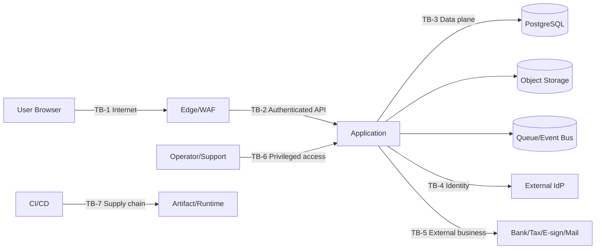

# Threat Model

## 状態とScope

- 状態: **Initial threat model / 実装前review必須**
- 基準日: 2026-08-09
- 対象: Web/API、Modular Monolith、DB、object、queue、IdP、external adapters、operator/support、CI/CD。
- 非対象: 選定前provider内部の詳細。ただし責任分界とvendor riskは対象。

## Assets

| Asset | Class | Security objective |
| --- | --- | --- |
| Credential/key/token | C4 | confidentiality、rotation、non-exportability |
| My Number/health/speak-up/investigation | C4 | strict confidentiality、purpose limitation、access evidence |
| Payroll/bank/payment | C4 | integrity、dual control、non-repudiation |
| Contract/accounting/tax records | C2-C4 | integrity、retention、availability、traceability |
| Authorization/rule versions | C3 | integrity、effective-date reproducibility |
| Audit/retention/hold | C3-C4 | append integrity、availability、authorized disclosure |
| Source/build/release | C2-C3 | provenance、integrity、secret absence |

## Trust boundaries

## Threats and controls

| Threat ID | Scenario | Impact | Prevent/Reduce | Detect/Recover | Verification |
| --- | --- | --- | --- | --- | --- |
| THR-AUTH-001 | tenant/org IDORで他scopeを閲覧 | C3/C4漏えい | server-side policy、resource scope、opaque ID | decision/audit anomaly | cross-tenant authz tests |
| THR-AUTH-002 | Role管理者が自分を昇格 | 全資産侵害 | SOD-IAM-001/002、dual approval、expiry | policy diff alert | self-approval negative test |
| THR-AUTH-003 | stale role/cacheで退職者access継続 | 個人/財務漏えい | short-lived token、revocation event、cache version | access certification | JML latency test |
| THR-DATA-001 | audit/log/searchへC4値を複製 | 広範漏えい、削除不能 | allowlist、token/ref、index segregation | DLP test/scanner | seeded secret/PII leak test |
| THR-DATA-002 | tenant filter欠落 | cross-tenant breach | tenant context at repository boundary、DB defense-in-depth | query/audit anomaly | mutation/property auth tests |
| THR-DATA-003 | backup/restoreで削除済data復活 | Privacy/retention違反 | encrypted backup、tombstone/hold replay | restore exercise | delete→backup→restore test |
| THR-FILE-001 | malware、polyglot、path/archive bomb | RCE/DoS | quarantine、no archive extraction、content sniff、size limit | scanner coverage alert | malicious corpus test |
| THR-FILE-002 | signed URL転送・長期有効 | document漏えい | short TTL、audience/scope binding、download policy | download audit | expired/replay URL test |
| THR-INT-001 | webhook spoof/replay | 不正状態遷移 | signature/mTLS、timestamp、nonce、idempotency | reconciliation | replay/tamper test |
| THR-INT-002 | SSRF via callback/import URL | internal/metadata access | no arbitrary fetch、allowlist、DNS/IP recheck、egress policy | egress alert | redirect/DNS rebinding test |
| THR-PAY-001 | supplier bank変更後に不正送金 | 金銭損失 | out-of-band verify、hold、SoD、amount limit | bank reconcile/alert | change→first payment E2E |
| THR-PAY-002 | timeout後payment二重送信 | 二重支払 | idempotency、state separation、no blind retry | bank statement reconcile | injected timeout test |
| THR-RULE-001 | 法令ruleの無審査改変 | 誤給与/違反 | signed reviewed publish、effective period、two-person control | result drift/compliance tests | historical replay test |
| THR-AUD-001 | adminがaudit/holdを削除 | 証拠隠滅 | append-only role separation、integrity chain/WORM評価 | independent export/checkpoint | tamper detection test |
| THR-OPS-001 | support impersonation濫用 | C4漏えい/不正操作 | default disabled、customer approval、purpose、session recording | real-time notice/review | expired/out-of-scope test |
| THR-SUP-001 | malicious dependency/build | 全system侵害 | lockfile、least CI token、SBOM、signature/provenance | scan/rebuild | provenance verification |
| THR-MIG-001 | 改変・欠落したmigrationを適用 | schema/data integrity侵害 | release checksum、filename/version一意、owner限定 | DB ledgerとdrift status | checksum/filename negative test |
| THR-MIG-002 | 並行deployまたは中断後の誤再実行 | 二重DDL、不完全schema、停止 | DB advisory lock、transaction、running state | verifyによるrecover、failed停止 | concurrency/interruption test |
| THR-MIG-003 | backupなしの本番migrationまたはowner credential漏洩 | 復旧不能、DB全権侵害 | backup evidence gate、secret manager/passfile、runtime role分離 | break-glass変更記録、ledger、restore演習 | production gate/privilege/restore test |
| THR-IAM-001 | realm importの再実行や破壊的同期でuser、credential、role assignment、sessionを損失 | 全社login不能、権限破壊 | additive reconciliation、managed field限定、未知resource保持 | plan/audit、upgrade前backup | 既存realm preservation test |
| THR-IAM-002 | 並行reconciliationまたは途中失敗でIAM設定が不整合 | login不能、claim/権限欠落 | mutation前のrealm lease、冪等操作、forward-fix | convergence plan、lease cleanup | lock/interruption/retry test |
| THR-IAM-003 | admin credentialが引数、log、artifactへ漏洩 | IdP全権侵害 | secret env/file、出力redaction、専用admin client | credential rotation、audit review | wrong-secret/secret-absence test |
| THR-CFG-001 | placeholder、平文transport、同一DB role、改変artifactのままproduction deploy | credential漏洩、migration権限奪取、supply-chain侵害 | versioned contract、SMB HTTPS/DB verify-full、runtime/owner分離、artifact checksum | read-only preflightのredacted JSONをchange evidenceへ保存 | offline/connected/privilege/TLS/tamper tests |
| THR-CFG-002 | preflightが秘密値を出力または検査中に外部状態を変更 | credential漏洩、予期しない本番変更 | 固定check ID/codeのみ出力、validateはoffline、checkはread-only、5秒timeout | seeded secret scan、DB/IAM state比較 | redaction/offline/timeout tests |
| THR-DOS-001 | unbounded report/export/rule evaluation | availability/cost | NFR limits、async quotas、cancellation | saturation metrics | load/limit test |

## Abuse cases

- managerが部下の給与以外のC4 caseを汎用検索する。
- payroll preparerがemployment変更とpayroll承認を連続して行う。
- operatorがexternal acknowledgmentを手動で成功へ変更する。
- attackerがCSV formulaでexport閲覧者の端末からdataを送信する。
- 法令sourceが更新された後も古いruleが「確認済み」と表示される。
- operatorが空または無関係なfileをbackup evidenceとして本番migrationを開始する。
- Legal Hold解除とretention jobが競合し、保持対象が削除される。

## Security gates

認証・認可、C4 data、payment、external URL、archive/import、delete/restore、migration、rule publishの変更には、Threat ID、negative test、rollback/fail-closed、audit eventをImplementation Contractへ含める。

## 受け入れ条件

- [x] Asset、trust boundary、threat、control、verificationを対応付けた。
- [x] Security、Privacy、Payment、Rule、Audit、Supply chain、DoSを扱った。
- [x] 実装契約へ引き継ぐsecurity gateを定義した。
- [x] TASK-006のNode/Next.js/PostgreSQL/Keycloak/S3/outbox選定を反映した。
